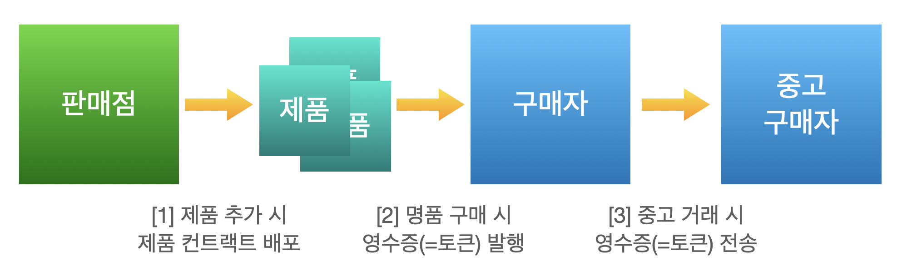
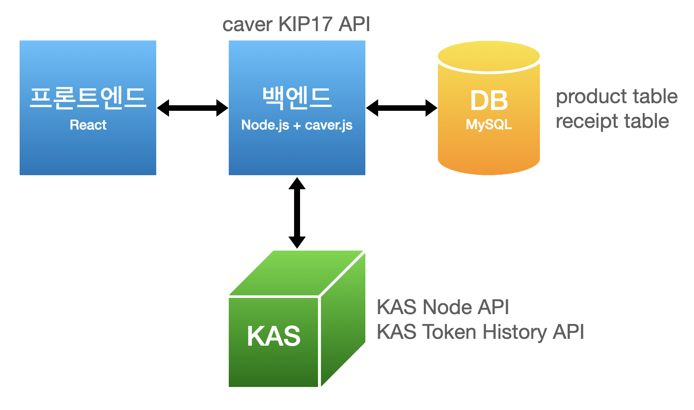

## 개요

고가의 명품을 중고 거래할 때 명품을 구입한 가게에서 받은 영수증도 같이 보여주는 일은 꽤 빈번합니다. 내가 산 명품이 "진짜"임을 증명하는 방법이기도 하고, 모조품을 구하는 것보다 가짜 영수증을 만드는 것이 어떻게보면 더 어렵기 때문입니다. 그런데, 이렇게 중고 거래를 하려면 처음 받은 영수증을 보관하고 있어야 하는데 영수증은 보관하기 어렵습니다. 작고 얇아서 잃어버리거나 찢어지거나 구거지기 쉽고, 감열지를 사용하므로 열이나 빛을 받으면 내용이 쉽게 지워집니다.

따라서 블록체인에 명품 영수증을 보관한다면 영수증을 안전하게 영구적으로 보관하면서 이를 거래 시 자유롭게 활용할 수 있을 것입니다. 이 튜토리얼은 Ground X의 블록체인인 클레이튼상에서 영수증을 보관하고 전송하는 BApp(블록체인 애플리케이션) 에제를 소개합니다. 이 예제는 클레이튼의 [대체 불가 토큰](http://wiki.hash.kr/index.php/%EB%8C%80%EC%B2%B4%EB%B6%88%EA%B0%80%ED%86%A0%ED%81%B0)(Non-fungible Token, NFT)인 [KIP-17](https://ko.docs.klaytn.com/smart-contract/token-standard#non-fungible-token-standard-kip-17)을 기반으로 전자 영수증을 발행해서 중고 거래에 사용하도록 합니다. 영수증은 클레이튼에 배포되므로 영수증 주인이 개인키를 잃어버리지 않는 한 클레이튼상에 계속 보관해둘 수 있습니다. 따라서 중고 거래를 할 때 새로운 주인에게 영수증을 안전하고 쉽게 전달할 수 있고, 새로운 주인이 명품을 재판매할 때에도 동일하게 다음 주인에게 영수증을 넘겨줄 수 있습니다.

하나의 명품은 하나의 NFT(KIP-17) 스마트 컨트랙트를, 하나의 영수증은 하나의 NFT 토큰을 나타냅니다. 명품 브랜드마다, 혹은 브랜드를 판매하는 가게 수준에서 관리하는 기능을 추가할 수도 있으나, 이 튜토리얼에서는 하나의 가게만 존재하는 상황을 가정합니다.

이 애플리케이션의 핵심 기능은 아래와 같습니다.



1. 새로운 NFT 스마트 컨트랙트 배포 = 명품 가게에서 새로운 명품을 (블록체인상에서) 등록
2. 새로운 NFT 토큰 발행 = 가게에서 명품을 판매하고 전자 영수증을 (블록체인상에서) 손님에게 발급
3. NFT 토큰 전송 = 가게에서 명품을 구매한 손님이 다른 사람에게 중고로 판매할 때 (블록체인상에서) 영수증을 전송

위 기능들을 구현하기 위해, 아래와 같이 시스템을 구성하였습니다.

* Frontend: React
* Backend: Node.js, [caver-js](caver-js 링크)
  * caver-js: KIP-17 토큰 컨트랙트 배포, 토큰 발행, 토큰 전송
* DB: MySQL
  * 명품 가게에서 상품 정보, 발행한 영수증 정보 저장
* KAS: Klaytn Node API, Token History API
  * Klaytn Node API로 클레이튼 Endpoint Node 사용
  * Token History API로 토큰 발급 기록 조회



이 튜토리얼의 모든 내용은 KAS를 활용하는 블록체인 애플리케이션 개발을 돕기 위한 예제입니다. 소스코드를 포함해 이 튜토리얼에서 소개하는 모든 내용은 사용자 개발 환경에 따라 다르게 적용될 수 있습니다. 소스코드를 포함해 이 튜토리얼에서 소개하는 모든 내용을 사용하는 것에 대한 모든 책임은 전적으로 사용자 본인에게 있습니다.

이 문서 혹은 KAS에 관한 문의는 [개발자 포럼]()을 방문해 도움을 받으십시오.

## 시작하기

### 프로그램 설치

- [Node.js](https://nodejs.org/ko/) & [yarn](https://classic.yarnpkg.com/en/docs/install) 설치
- [MySQL](https://dev.mysql.com/doc/mysql-installation-excerpt/5.7/en/) 설치
  - 코드에서는 아이디 `root`, 패스워드 `root`로 설정되어있습니다.
  - `test` 데이터베이스에 테이블이 존재하기 때문에, `test` 데이터베이스가 없는 경우 생성해야 합니다.

### 데이터베이스 셋업

- `product`와 `receipt` 두 개의 테이블이 필요합니다.
- `product`는 등록된 명품을 관리하기 위한 테이블입니다.

```mysql
CREATE TABLE `product` (
  `id` INT NOT NULL AUTO_INCREMENT,
	`name` VARCHAR(64) NOT NULL,
	`image` VARCHAR(128) NOT NULL,
	`contractAddr` VARCHAR(256) DEFAULT NULL,
	`registeredDate` DATETIME NOT NULL,
	`isDeleted` INT NOT NULL,
	`symbol` VARCHAR(64) NOT NULL,
	PRIMARY KEY (`id`)
) ENGINE = INNODB AUTO_INCREMENT = 22 DEFAULT CHARSET = utf8;
```

- `receipt` 는 발행된 영수증을 관리하기 위한 테이블입니다.

```mysql
CREATE TABLE `receipt` (
  `id` INT NOT NULL AUTO_INCREMENT,
	`sellerID` INT NOT NULL,
	`productID` INT NOT NULL,
	`tokenID` BIGINT NOT NULL,
	`tokenURI` VARCHAR(256) NOT NULL,
	`contractAddr` VARCHAR(256) NOT NULL,
	`fromAddr` VARCHAR(256) NOT NULL,
	`toAddr` VARCHAR(256) NOT NULL,
	`registeredDate` DATETIME NOT NULL,
	`lastUpdatedDate` DATETIME NOT NULL,
	`isDeleted` INT NOT NULL,
	PRIMARY KEY (`id`)
) ENGINE = INNODB AUTO_INCREMENT = 29 DEFAULT CHARSET = utf8;
```

### 저장소 복사하기

- http://github.com/ground-x/kas-bapp-luxurytracker 에 있는 코드를 클론합니다.

```bash
git clone git@github.com:ground-x/kas-bapp-luxurytracker.git
```

### npm install

- 루트 디렉토리의 `server.js` 파일이 백엔드 서버 기능을 담당하고, `client` 디렉토리는 리액트 기반 프론트엔드 기능을 담당합니다. 이렇게, 이 튜토리얼은 백엔드/프론트엔드 모두 자바스크립트 기반의 패키지 매니저를 사용했기 때문에 `npm install`이 2번 필요합니다: 루트 디렉토리에서 1번, `client` 디렉토리에서 1번 `npm install`이 필요합니다.

```bash
npm install
cd client
npm install
```

### KAS 설정하기

- `client/src/Config.js`에 KAS Console을 통해 발급받은 accessKeyId와 secretAccessKey를 입력합니다.

```js
const accessKeyId = "YOUR_ACCESS_KEY_ID_FROM_KAS_CONSOLE";
const secretAccessKey = "YOUR_SECRET_ACCESS_KEY_FROM_KAS_CONSOLE";
```

### 실행하기

- 루트 디렉토리에서 아래 명령어를 실행합니다. 아래 명령어로 백엔드 서버와 프론트엔드를 한 번에 실행시킬 수 있습니다. http://localhost:3000 에서 실행된 프로그램을 확인할 수 있습니다.
  (해당 포트가 이미 사용중인 경우 다른 포트 번호를 사용하십시오.)

```bash
yarn dev
```

이 문서 혹은 KAS에 관한 문의는 [개발자 포럼](https://forum.klaytn.com/)을 방문해 도움을 받으십시오.
